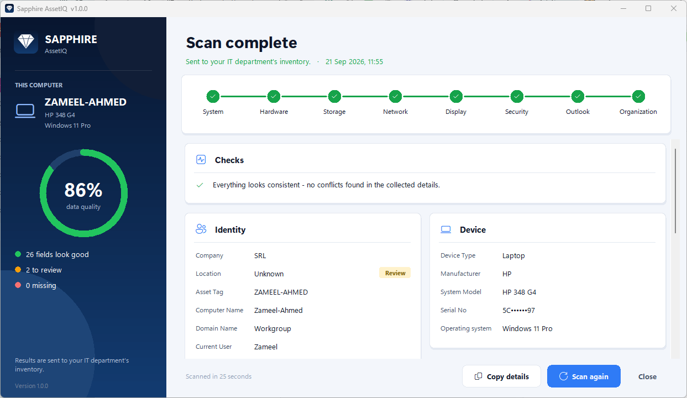

# Sapphire AssetIQ

**An IT asset inventory agent for Windows fleets.** It runs at logon, reads 28 facts about the
machine it is on, and writes them as **one row per computer** into a central Google Sheet —
replacing the "one Excel file per PC, collected by hand" process it was built to kill.



Built for a retail company's IT department (~hundreds of PCs, laptops and point-of-sale tills
across sites), deployed through Active Directory. In production since September 2026.

---

## The problem it solves

IT had one spreadsheet per computer, filled in by hand whenever someone got around to it. Nobody
could answer "how many machines have less than 8 GB of RAM" without opening dozens of files, and
every answer was out of date.

AssetIQ inverts that: each machine reports **itself**, every logon, into one sheet that is always
current. A machine that is scanned again updates its own row instead of adding another.

## What it collects

Identity and location, hardware, storage, displays, network, the signed-in user, mail account and
security state — 28 fields, defined once in [`src/config/schema.py`](src/config/schema.py), which is
the single source of truth for collection, validation and the sheet writer.

| Group | Fields |
|---|---|
| Identity | Company, Location, Asset Tag, Computer Name, Domain, Current User |
| Device | Device Type, Manufacturer, Model, Serial No, OS |
| Processor & memory | CPU, RAM (GB), RAM slots |
| Storage | Disk (GB), Disk Type (SSD/HDD), No. of Disks |
| Displays | Display Size, No. of Displays, External Displays |
| Network | IP Address, Subnet, MAC Address |
| Mail & security | Outlook Email, Antivirus, VPN |
| Record | Created At, Updated At |

## Where the AI comes in

Collecting the facts is deterministic: Windows reports them and AssetIQ reads them. The
**intelligence layer** runs after collection and does what a careful IT admin would do with the raw
record — cross-checks it, spots what doesn't add up, and decides what needs a human. It never fills
in a value Windows could not report; it flags it for review instead.

| Capability | What it decides | Example |
|---|---|---|
| Device classification | Whether the chassis reading agrees with the other signals — model name and battery | Chassis says *Desktop* but the model is a *ThinkPad*: flagged for review, never silently changed |
| Consistency checking | Whether the record contradicts itself | A "laptop" with a 20-inch built-in screen is really an all-in-one till reporting laptop firmware values |
| Anomaly detection | Whether a value sits outside the normal range for the fleet | 2 GB of RAM, or an 8 TB disk, in an office fleet |
| Fleet-level duplicate detection | Whether this machine collides with a different row in the central sheet | Same computer name with a different serial: a renamed or re-imaged machine |
| Data-quality scoring | How complete and trustworthy each record is | The 0–100% score in the window, and the Review / Missing badges |

**Rule-based on purpose.** V1 uses explainable, rule-based inference rather than a trained model:
every flag has to carry a reason the IT team can check, and give the same answer on the next run —
and there was no labelled history to learn from yet. The rules live in
[`src/services/intelligence_service.py`](src/services/intelligence_service.py) and
[`src/services/validation_service.py`](src/services/validation_service.py). The central sheet
AssetIQ builds up *is* that history, which makes learned models the next step: replacement
planning, fleet-wide anomaly detection, and plain-language questions over the inventory.

## Engineering notes

The parts that were more interesting than they look:

- **Nothing is guessed.** A value Windows cannot report is written as `Not Available` with a
  `review` status, never inferred. A confidently wrong row is worse than a flagged one, because a
  wrong value passes validation silently.
- **Company, Location and Asset Tag are resolved at run time, never hardcoded per machine.**
  Company comes from the joined AD domain, Location from the VLAN of the machine's own IP looked up
  in a shared map, Asset Tag from firmware or — failing that — the computer name, since this fleet
  names every machine after its asset code. One config file ships to every endpoint and each machine
  resolves itself.
- **Idempotent upsert.** Rows are matched on Asset Tag → Computer Name → Serial No → MAC Address,
  with normalisation for the mess real sheets contain (stray spaces, a leading apostrophe from a
  text-formatted cell, wrong case, a serial that came back as `12345.0`). MAC is tried last on
  purpose: laptops sharing a docking station report the same one. See
  [`src/config/identity.py`](src/config/identity.py).
- **A second look before inserting.** Collecting takes 20–40 seconds. If another run of the same
  machine added its row during that window, the scan updates that row rather than leaving a
  duplicate.
- **WMI is thread-bound.** WMI connections are COM objects owned by the thread that created them, so
  the window's "Scan again" (a fresh thread each time) originally returned a screen full of
  "Not available". Connections are now per-thread, and COM is only shut down on a scan thread once
  every object it made has been released — shutting it down early is an access violation at exit.
  See [`src/utils/wmi_utils.py`](src/utils/wmi_utils.py).
- **Displays come from EDID** (`root\wmi`), which is also how external monitors are told apart from
  the built-in panel — and how a "laptop" with a 27" screen gets flagged as a docked desktop.
- **Outlook, both of them.** The classic MAPI profile lives in binary registry blobs; new Outlook
  keeps accounts in `UserSettings.json`. Both are parsed, and whichever Outlook the user actually
  runs wins.
- **The logo is drawn, not shipped.** `tools/import_logo.py` turns an SVG into outlines;
  `src/gui/icon.py` fills them at any size for the window icon, the EXE icon and the sidebar. No
  image files, no imaging library, sharp from 16 px to 256 px. The production build uses the
  company's official logo; this repository ships a neutral mark in its place.
- **Nothing is written on the endpoint.** No output folder, no spreadsheet, no export — the central
  sheet is the record. The only file left behind is one small log per run under `%LOCALAPPDATA%`.

## Running it

```powershell
python -m venv .venv
.venv\Scripts\activate
pip install -r requirements.txt

copy config\config.example.json src\config.json    # then fill in your sheet id
copy <your-service-account>.json src\service_account.json

cd src
python main.py            # background scan, straight into the sheet
python main.py --window   # the same scan, with the window
python main.py --cli      # the same scan, printed in the console
```

### Google Sheets access

Create a Google Cloud service account, enable the Sheets API, download its JSON key, and share the
target sheet with the service account's e-mail address as an **Editor**. The key is referenced by
path and is never committed — see `.gitignore`.

### Building the EXE

```powershell
.\build.ps1
```

Produces one file, `dist\SapphireAssetIQ.exe`, that an AD logon script can run straight from a
share with nothing staged on the machine:

```bat
\\<server>\NETLOGON\SapphireAssetIQ.exe
```

No window, no console. Exit code `0` means the row was written.

> **The built EXE embeds `config.json` and the service-account key** so that a single file can be
> deployed. That is a deliberate trade-off, made with the customer: keep the EXE on a share users
> can only read and execute, and rotate the key if a copy leaves the domain. **A build of this
> program should never be published** — the key can be recovered from it.

## Layout

```
src/
├── main.py                  entry point: background / --window / --cli
├── scan_runner.py           one scan, shared by every mode
├── collector_service.py     runs the collectors, then normalise → validate → score
├── collectors/              one file per domain, each independent and failure-isolated
├── services/                Google Sheets upsert, validation, normalisation, the intelligence layer
├── config/                  the 28-field schema, identity matching, sheet presentation
├── gui/                     the window, drawn widgets, logo outlines
└── utils/                   WMI/COM handling, paths, logging
tools/                       icon + version resource, brand logo importer
```

A collector that fails never kills the scan: every field degrades to `missing` on its own and the
row is still written.

## Status

Version 1.0.0, in production. See [CHANGELOG.md](CHANGELOG.md) for how it got there.

Planned next: an installed agent instead of a logon script, historical tracking behind the sheet,
and a direct API into the company's asset portal.

## Ownership

Built by [Zameel Ahmed](https://www.linkedin.com/in/zameel-ahmed) for Sapphire Retail Limited, and published here with the company's
permission as a portfolio piece. The Sapphire name belongs to Sapphire Retail Limited, and its
official logo is deliberately not included here; the code is shared
to show the engineering, not as a product to reuse. No credentials, customer data, or internal
network details are included in this repository.
